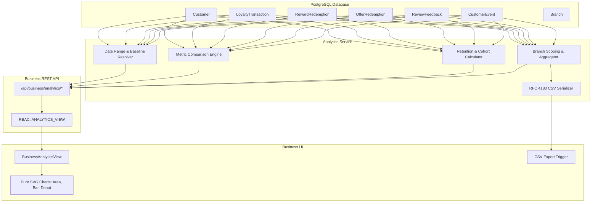

# REPLOYTY — PHASE 14 REPORT & AUDIT

## Analytics & Business Intelligence Engine

### 1. Executive Summary
Phase 14 delivers the production **Analytics & Business Intelligence (BI)** layer for Reployty. 

Built strictly on top of existing PostgreSQL data structures without mock data, fake generators, or heavy third-party BI dependencies, this system empowers business owners and managers with deep, actionable intelligence:
- **Comprehensive Activity & Growth**: Real customer footfall, active regulars, visit frequency, and registration channels.
- **Authoritative Customer Retention**: Industry-standard **Returning Customer Rate**, **Repeat Visit Rate**, and **Reactivation tracking** with complete formula transparency.
- **Engagement Performance**: Loyalty stamps/points issuance, reward redemption conversion rates, offer claim efficacy, and customer review sentiment trends.
- **Multi-Branch Intelligence**: Comparative cross-branch benchmarking and branch-scoped drill-downs with strict staff permission enforcement.
- **Enterprise-Grade Export**: 1-click RFC 4180-compliant CSV exports across 7 dataset types.

---

### 2. Architecture & Data Flow



---

### 3. Core Algorithms & Metric Formulas

#### 3.1 Date Range & Comparison Resolution
- **Standard Presets**: `today`, `yesterday`, `7d`, `30d`, `90d`, `this_month`, `prev_month`, `this_year`, `custom`.
- **Baseline Period**: For any period of duration $D$, the comparison period begins at $t_{\text{start}} - D - 1\text{ms}$ and ends at $t_{\text{start}} - 1\text{ms}$, guaranteeing an exact 1:1 duration match.
- **Safe Comparison Delta**:
  $$\Delta = \text{Current} - \text{Previous}$$
  $$\text{Percent Change} = \begin{cases} 
  0\% & \text{if Previous} = 0 \text{ and Current} = 0 \\ 
  +100\% & \text{if Previous} = 0 \text{ and Current} > 0 \\ 
  -100\% & \text{if Previous} > 0 \text{ and Current} = 0 \\ 
  \text{round}\left(\frac{\Delta}{\text{Previous}} \times 100\right) & \text{otherwise} 
  \end{cases}$$
  *Prevents `NaN`, `Infinity`, or divide-by-zero crashes.*

#### 3.2 Customer Retention Formulas
- **Returning Customer Rate**:
  $$\text{Returning Customer Rate} = \frac{\text{Visiting Customers with } >1 \text{ visit in period}}{\text{Total Unique Customers Visiting in period}} \times 100$$
- **Repeat Visit Rate**:
  $$\text{Repeat Visit Rate} = \frac{\text{Visits after the 1st visit in period}}{\text{Total Activity Visits in period}} \times 100$$
- **Reactivated Customers**:
  Number of unique customers whose preceding visit was $> 30$ days prior and who visited again during the period.
- **At-Risk Customers**:
  Customers with status `AT_RISK` (inactive between 30 and 60 days).

#### 3.3 Loyalty & Rewards Metrics
- **Reward Redemption Rate**:
  $$\text{Redemption Rate} = \frac{\text{Total Rewards Redeemed}}{\text{Total Rewards Claimed}} \times 100$$
- **Loyalty Issuance**: Real stamp and point increments summed from atomic ledger transactions.

#### 3.4 Review & Google CTA Semantics
- **Google Review Targets**: Measures instances where customers rated 4–5 stars and were redirected to the business's public Google Review URL via the CTA.
- **Disclosure Rule**: Reployty transparently displays that it does not claim to publish or scrape third-party Google profiles; only internal click-through routing is tracked.

---

### 4. Implementation Details by Layer

#### Layer 1: Analytics Service ([analyticsService.ts](file:///Users/jadejanildeepsinh/Desktop/REPLOYTY/src/server/services/analyticsService.ts))
- `requireAnalyticsPermission(ctx)`: Enforces `ANALYTICS_VIEW`, `isOwner`, or `isSuperAdmin`.
- `resolveEffectiveBranch(ctx, branchId)`: Enforces branch isolation for staff assigned to a single branch.
- `getAnalyticsOverview(ctx, query)`: Multi-metric concurrent aggregations with previous period comparisons and 14-day activity timelines.
- `getCustomerAnalytics(ctx, query)`: Status distribution (`ACTIVE`, `INACTIVE`, `VIP`, `AT_RISK`, `BLOCKED`), growth timeline, and acquisition channels.
- `getRetentionAnalytics(ctx, query)`: Returning customer rate, repeat visit rate, visit frequency breakdowns, and definitions.
- `getLoyaltyAnalytics(ctx, query)` & `getRewardsAnalytics(ctx, query)`: Active members, stamps/points issued over time, top rewards, and catalog redemption rates.
- `getOffersAnalytics(ctx, query)`: Active offers, redemption counts, top offers, and redemption timeline.
- `getReviewAnalytics(ctx, query)`: Rating distributions (1★ to 5★), sentiment breakdown, AI coverage, and Google CTA targets.
- `getBranchAnalytics(ctx, query)`: Per-branch comparative table metrics.
- `exportAnalyticsCsv(ctx, query, exportType)`: RFC 4180 CSV generator.

#### Layer 2: API Endpoints & RBAC ([businessRoutes.ts](file:///Users/jadejanildeepsinh/Desktop/REPLOYTY/src/server/api/businessRoutes.ts))
Mounted endpoints:
- `GET /api/business/analytics/overview`
- `GET /api/business/analytics/customers`
- `GET /api/business/analytics/retention`
- `GET /api/business/analytics/loyalty`
- `GET /api/business/analytics/rewards`
- `GET /api/business/analytics/offers`
- `GET /api/business/analytics/reviews`
- `GET /api/business/analytics/branches`
- `GET /api/business/analytics/export` (streams CSV with `Content-Type: text/csv` and filename attachment)

#### Layer 3: Pure SVG Visualizations ([AnalyticsCharts.tsx](file:///Users/jadejanildeepsinh/Desktop/REPLOYTY/src/components/analytics/AnalyticsCharts.tsx))
- **`AnalyticsAreaChart`**: Responsive SVG curve with smooth gradient fill, hover points, interactive tooltips, grid lines, and previous-period dashed comparison path.
- **`AnalyticsBarChart`**: Vertical SVG bars and horizontal comparison bars for rankings and category breakdowns.
- **`AnalyticsDonutChart`**: Multi-segment circular distribution with center summary counters and hover states.

#### Layer 4: Business Analytics UI ([BusinessAnalyticsView.tsx](file:///Users/jadejanildeepsinh/Desktop/REPLOYTY/src/views/business/BusinessAnalyticsView.tsx))
- **Preset Controls**: Quick dropdown (`Today`, `Yesterday`, `7d`, `30d`, `90d`, `This Month`, `Previous Month`, `This Year`, `Custom Range`) with start/end date pickers.
- **Dual-Period KPI Cards**: Showing current value, previous period baseline, delta, and percentage badge with color status.
- **Navigation Tabs**:
  1. *Overview*: Platform activity timeline, KPI cards, customer distribution, acquisition mix.
  2. *Retention & Cohorts*: Returning customer rate, repeat visit rate, reactivated patrons, and educational calculation guide.
  3. *Loyalty & Rewards*: Issuance timeseries, redemption rates, top performing rewards.
  4. *Special Offers*: Active offer counts, redemption timeline, top performing offers.
  5. *Reviews & Feedback*: Star distribution (1★-5★), sentiment donut chart, AI coverage, Google target disclosure.
  6. *Branch Comparison*: Cross-branch comparison table and branch activity chart.
- **Integrated Navigation**: Unlocked in [Sidebar.tsx](file:///Users/jadejanildeepsinh/Desktop/REPLOYTY/src/components/layout/Sidebar.tsx) and routed in [App.tsx](file:///Users/jadejanildeepsinh/Desktop/REPLOYTY/src/App.tsx).

---

### 5. Multi-Tenant Security & RBAC Enforcement

| Role / Entity | Permission State | Access Result |
| :--- | :--- | :--- |
| **Business Owner** (`OWNER`) | Has `ANALYTICS_VIEW` | 200 OK — Full business analytics & exports across all branches |
| **Business Manager** (`MANAGER`) | Has `ANALYTICS_VIEW` | 200 OK — Full analytics access |
| **Cashier / Staff** (`STAFF`) | Lacks `ANALYTICS_VIEW` | 403 Forbidden — Denied on all service calls and HTTP endpoints |
| **Single-Branch Staff** | Assigned specific `branchId` | Queries automatically constrained to assigned branch |
| **Cross-Tenant Queries** | Tenant B context | 100% Isolated — Tenant B cannot observe Tenant A data |

---

### 6. Verification & Automated Test Results

#### 6.1 Phase 14 Test Suite ([analytics.test.ts](file:///Users/jadejanildeepsinh/Desktop/REPLOYTY/tests/analytics/analytics.test.ts))
Ran `npx tsx tests/analytics/analytics.test.ts`:
- **84 / 84 tests passing (100% Pass Rate)**:
  - Setup & Context Validation: Verified Tenant A, Tenant B, Owner, and Staff contexts.
  - Date Range Resolution: Correct durations and boundary alignment across all presets.
  - Metric Math: Zero baseline, negative change, positive change, zero both.
  - Customer & Retention: Status distribution, returning customer rate, repeat visit rate.
  - Loyalty, Rewards, Offers & Reviews: Full metric integrity and timeseries validation.
  - Multi-Branch & Tenant Isolation: Verified cross-tenant exclusion and branch filtering.
  - RBAC: Verified Cashier rejection with `403 Forbidden`.
  - CSV Export: Verified RFC 4180 output formatting and headers.
  - HTTP REST APIs: Verified all 9 endpoints returned `200 OK` with correct JSON/CSV schemas.

#### 6.2 Full Regression Test Suite (`npm test`)
Ran repository-wide test execution across all 14 phases:
```
ℹ tests 14
ℹ suites 0
ℹ pass 14
ℹ fail 0
ℹ cancelled 0
ℹ skipped 0
ℹ todo 0
ℹ duration_ms 13014.253459
```
*Zero regressions across all completed phases (Auth, Core, Customer, CRM, Loyalty, Catalog, Rewards, Offers, Reviews, Analytics).*

#### 6.3 Production Build Verification (`npm run build`)
```
✓ 1971 modules transformed.
dist/index.html                     1.20 kB │ gzip:   0.65 kB
dist/assets/index-GW_jm7Pd.css     34.22 kB │ gzip:   6.43 kB
dist/assets/index-BIeQ8X2X.js   1,750.94 kB │ gzip: 296.85 kB
✓ built in 2.95s
```
*Zero TypeScript compiler errors (`tsc -b` passed).*
